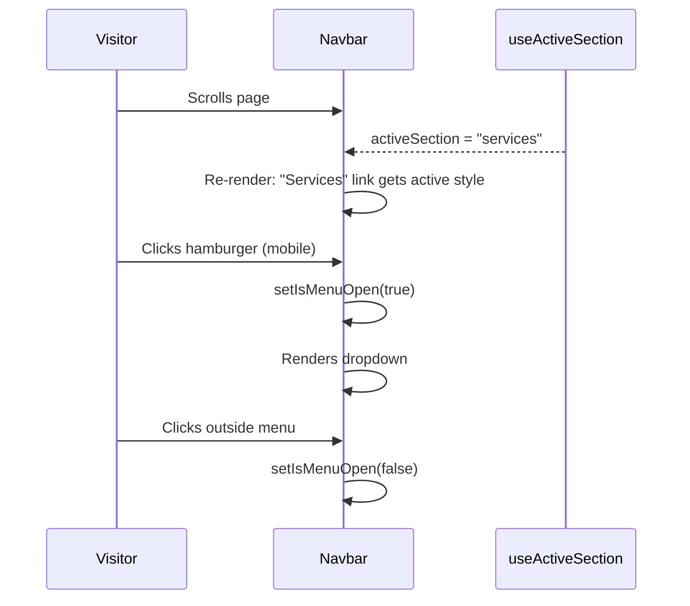
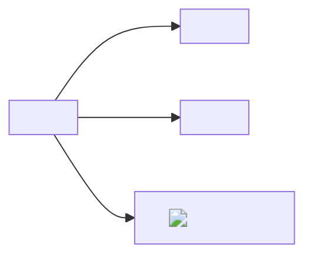
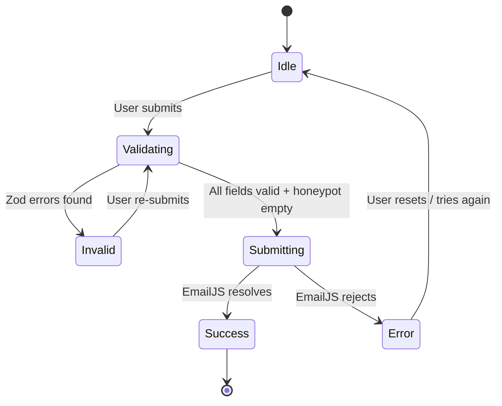

# Design Document: Evergreen Arbor Services Liverpool Website

## Overview

Evergreen Arbor Services Liverpool is a professional tree surgery and arborist business serving Liverpool and the wider Merseyside region. This document describes the complete technical design for a single-page-style marketing website built with React 18 + Vite + TypeScript. The site is statically generated and deployed to Vercel or Netlify, providing a fast, accessible, and locally-optimised digital presence that allows prospective customers to learn about the company's services, view completed work, read testimonials, and submit quote requests.

The architecture prioritises Core Web Vital scores (LCP ≤ 2.5 s, CLS ≤ 0.1), WCAG 2.1 Level AA conformance, and local SEO, while keeping the codebase maintainable by a single developer with no CMS dependency in the initial release.

---

## Architecture

```mermaid
graph TD
    subgraph "Browser"
        A[React 18 App] --> B[React Router v6]
        B --> C[/ Home Page]
        B --> D[/privacy-policy]
        B --> E[/cookie-policy]
        B --> F[/404]
        A --> G[Context Providers]
        G --> H[CookieConsentContext]
        G --> I[LightboxContext]
    end

    subgraph "Build & Tooling"
        J[Vite 5] --> K[TypeScript]
        J --> L[Tailwind CSS v3]
        J --> M[vite-imagetools / WebP]
        J --> N[vite-plugin-sitemap]
    end

    subgraph "Third-Party Services"
        O[EmailJS] --> P[Admin Email Inbox]
        Q[Google Maps Embed API]
        R[Google Analytics 4]
    end

    C --> O
    C --> Q
    A --> R
```

### Rendering Strategy

The application is a **client-side rendered (CSR) React SPA** compiled to a static bundle (`dist/`). React Router v6 handles client-side routing between the Home page and the legal/error pages. All above-the-fold content is rendered on the first paint; below-the-fold sections are lazy-loaded via `React.lazy` and `Suspense`.

Vercel/Netlify edge configuration provides:
- HTTP security headers (CSP, X-Frame-Options, etc.)
- Cache-Control headers for static assets
- HTTPS enforcement with 301 redirect from HTTP
- SPA fallback rewrites (`/* → /index.html`)

---

## Project Structure

```
evergreen-arbor-website/
├── public/
│   ├── favicon.ico
│   ├── robots.txt
│   ├── sitemap.xml           # generated at build time
│   └── assets/
│       └── og-image.jpg      # Open Graph preview image
├── src/
│   ├── main.tsx              # React 18 createRoot entry point
│   ├── App.tsx               # Router + Context Providers
│   ├── index.css             # Tailwind base/components/utilities
│   │
│   ├── config/
│   │   └── site.ts           # ← single source of truth for contact details
│   │
│   ├── data/
│   │   ├── services.ts       # ServiceItem[] static data
│   │   ├── testimonials.ts   # Testimonial[] static data
│   │   └── gallery.ts        # GalleryImage[] static data
│   │
│   ├── types/
│   │   └── index.ts          # Shared TypeScript interfaces
│   │
│   ├── context/
│   │   ├── CookieConsentContext.tsx
│   │   └── LightboxContext.tsx
│   │
│   ├── hooks/
│   │   ├── useActiveSection.ts   # IntersectionObserver for nav highlight
│   │   ├── useClickOutside.ts    # closes menus/modals on outside click
│   │   └── useScrollLock.ts      # locks body scroll when modal open
│   │
│   ├── components/
│   │   ├── layout/
│   │   │   ├── Navbar.tsx
│   │   │   ├── Footer.tsx
│   │   │   └── SkipLink.tsx
│   │   │
│   │   ├── sections/
│   │   │   ├── Hero.tsx
│   │   │   ├── Services.tsx
│   │   │   ├── About.tsx
│   │   │   ├── Gallery.tsx
│   │   │   ├── Testimonials.tsx
│   │   │   └── Contact.tsx
│   │   │
│   │   ├── ui/
│   │   │   ├── ServiceCard.tsx
│   │   │   ├── TestimonialCard.tsx
│   │   │   ├── LightboxModal.tsx
│   │   │   ├── CookieConsentBanner.tsx
│   │   │   ├── StarRating.tsx
│   │   │   └── SchemaMarkup.tsx
│   │   │
│   │   └── forms/
│   │       └── QuoteRequestForm.tsx
│   │
│   ├── pages/
│   │   ├── HomePage.tsx
│   │   ├── PrivacyPolicyPage.tsx
│   │   ├── CookiePolicyPage.tsx
│   │   └── NotFoundPage.tsx
│   │
│   └── utils/
│       ├── analytics.ts      # GA4 event helpers
│       └── emailjs.ts        # EmailJS send wrapper
│
├── vercel.json               # or netlify.toml — headers + rewrites
├── tailwind.config.ts
├── vite.config.ts
├── tsconfig.json
└── README.md
```

### Key Configuration: `src/config/site.ts`

This plain-text configuration file (Req 13.4) centralises contact details so the Admin can update them without touching component code:

```typescript
// src/config/site.ts
export const SITE_CONFIG = {
  businessName: 'Evergreen Arbor Services',
  tagline: 'Professional Tree Surgery & Arborist Services in Liverpool',
  phone: '0151 XXX XXXX',
  email: 'info@evergreenarborservices.co.uk',
  address: {
    street: '',
    city: 'Liverpool',
    county: 'Merseyside',
    postcode: '',
    country: 'GB',
  },
  serviceArea: 'Liverpool and Merseyside',
  googleMapsUrl: 'https://maps.google.com/?q=Liverpool,Merseyside',
  googleBusinessProfileUrl: 'https://g.page/r/YOUR_REVIEW_LINK',
  social: {
    facebook: 'https://facebook.com/evergreenarborservices',
    instagram: 'https://instagram.com/evergreenarborservices',
  },
  seo: {
    defaultTitle: 'Tree Surgeon Liverpool | Evergreen Arbor Services',
    defaultDescription:
      'Professional tree surgery and arborist services across Liverpool and Merseyside. Tree felling, crown reduction, stump grinding & more. Get a free quote today.',
    siteUrl: 'https://www.evergreenarborservices.co.uk',
    ogImage: '/assets/og-image.jpg',
  },
} as const
```

---

## Routing

React Router v6 `<BrowserRouter>` manages four routes:

```typescript
// src/App.tsx (simplified)
const PrivacyPolicyPage = React.lazy(() => import('./pages/PrivacyPolicyPage'))
const CookiePolicyPage  = React.lazy(() => import('./pages/CookiePolicyPage'))
const NotFoundPage      = React.lazy(() => import('./pages/NotFoundPage'))

export default function App() {
  return (
    <CookieConsentProvider>
      <LightboxProvider>
        <HelmetProvider>
          <BrowserRouter>
            <SkipLink />
            <Navbar />
            <Suspense fallback={<PageLoader />}>
              <Routes>
                <Route path="/"               element={<HomePage />} />
                <Route path="/privacy-policy" element={<PrivacyPolicyPage />} />
                <Route path="/cookie-policy"  element={<CookiePolicyPage />} />
                <Route path="*"               element={<NotFoundPage />} />
              </Routes>
            </Suspense>
            <Footer />
            <CookieConsentBanner />
          </BrowserRouter>
        </HelmetProvider>
      </LightboxProvider>
    </CookieConsentProvider>
  )
}
```

The `/privacy-policy`, `/cookie-policy`, and `404` routes are code-split via `React.lazy`. Vercel/Netlify rewrites all unknown paths to `index.html` so the client-side `*` catch-all renders `NotFoundPage`.

---

## Component Architecture

### Layout Components

#### `SkipLink`

```typescript
// src/components/layout/SkipLink.tsx
export function SkipLink() {
  return (
    <a
      href="#main-content"
      className="sr-only focus:not-sr-only focus:absolute focus:top-4 focus:left-4
                 focus:z-[9999] focus:px-4 focus:py-2 focus:bg-white focus:text-green-800
                 focus:rounded focus:ring-2 focus:ring-green-600"
    >
      Skip to main content
    </a>
  )
}
```

The link is visually hidden until focused (Req 10.5). It targets `id="main-content"` on the `<main>` element in each page.

---

#### `Navbar`

**Responsibilities:**
- Render the company logo (top-left) and navigation links
- Sticky positioning (`position: sticky; top: 0`)
- Collapse to a hamburger toggle below 768 px
- Highlight the active section link via `useActiveSection`
- Close mobile menu on: toggle click, link click, outside click (Req 1.3, 1.4, 1.7, 1.8, 1.9)

```typescript
interface NavLink {
  label: string
  href: string   // '#services', '#about', '/privacy-policy', etc.
}

const NAV_LINKS: NavLink[] = [
  { label: 'Home',         href: '#hero' },
  { label: 'Services',     href: '#services' },
  { label: 'About Us',     href: '#about' },
  { label: 'Gallery',      href: '#gallery' },
  { label: 'Testimonials', href: '#testimonials' },
  { label: 'Contact',      href: '#contact' },
]
```

State:
- `isMenuOpen: boolean` — controls mobile dropdown visibility
- `activeSection: string` — from `useActiveSection` hook

Accessibility:
- `<nav role="navigation" aria-label="Main navigation">`
- Hamburger `<button>` has `aria-expanded={isMenuOpen}` and `aria-controls="mobile-menu"`
- Mobile menu `<div id="mobile-menu">` has `aria-hidden={!isMenuOpen}`
- All nav links are `<a>` elements (keyboard-operable without JS)



---

#### `Footer`

```typescript
interface FooterProps {}   // no props — reads SITE_CONFIG directly

// Renders:
//  - Business name + tagline
//  - Phone: <a href="tel:…">
//  - Email: <a href="mailto:…">
//  - Service area text
//  - Social icons (Facebook, Instagram) — target="_blank" rel="noopener noreferrer"
//  - Links: Privacy Policy, Cookie Policy
//  - Copyright notice
```

Social icon links: minimum 44×44 px tap target, `aria-label="Evergreen Arbor Services on Facebook"` (Req 15.1, 15.2, 15.3).

---

### Page Sections

All sections receive `id` attributes matching the Navbar `href` targets and use semantic `<section>` elements with `aria-labelledby` pointing to their heading.

#### `Hero`

```typescript
interface HeroProps {}

// Internal layout:
//  - <section id="hero" aria-labelledby="hero-heading">
//  - Background: <picture> with WebP <source> + JPEG fallback
//  - Overlay: semi-transparent gradient for contrast
//  - <h1 id="hero-heading">Evergreen Arbor Services</h1>
//  - <p> sub-headline mentioning "Liverpool" and "tree surgery"
//  - Two CTA <a> elements (href="#contact", href="#services")
//  - Fallback background-color if image fails (CSS, Req 2.6)
```

The hero background image is `fetchpriority="high"` and not lazy-loaded (largest contentful paint candidate).

Performance: hero image served in WebP via Vite's `vite-imagetools` transform; `<picture>` element with AVIF source attempted first, WebP second, JPEG fallback (Req 9.4).



---

#### `Services`

```typescript
interface ServicesProps {}

// Renders:
//  - <section id="services" aria-labelledby="services-heading">
//  - <h2 id="services-heading">Our Services</h2>
//  - Grid of <ServiceCard> components (9 cards, Req 3.1)
//  - Accordion expansion within each card (Req 3.4)
//  - CTA button at bottom → '#contact' (Req 3.3)
```

Layout: CSS Grid — 1 column (mobile), 2 columns (tablet), 3 columns (desktop) via Tailwind `grid-cols-1 md:grid-cols-2 lg:grid-cols-3`.

---

#### `About`

```typescript
interface AboutProps {}

// Renders:
//  - <section id="about" aria-labelledby="about-heading">
//  - <h2>About Us</h2>
//  - Establishment year, years in service, mission description (Req 4.1)
//  - Qualifications & certifications list (Req 4.2)
//  - Team photograph (Req 4.3)
//  - Geographic service area (Req 4.4)
//  - Health & safety statement (Req 4.5)
//  - Trust indicators: insurance amount + Arb Assoc logo (Req 4.6)
```

---

#### `Gallery`

```typescript
interface GalleryProps {}

// Renders:
//  - <section id="gallery" aria-labelledby="gallery-heading">
//  - <h2>Our Work</h2>
//  - Responsive image grid: 2 cols (≤768px), 3+ cols (≥769px) (Req 5.6)
//  - Each thumbnail: <button> wrapping  (Req 5.7)
//  - On thumbnail click: opens LightboxModal (Req 5.2)
```

All thumbnails use `loading="lazy"`. The first 3 images in the viewport on initial load omit `loading="lazy"` to avoid LCP regression.

Each `` has a non-empty `alt` describing the photograph subject (Req 5.5, 8.7).

On image load error: CSS `::after` pseudo-element renders the `alt` text, and `object-fit: contain` prevents broken-image icon (Req 16.3).

---

#### `Testimonials`

```typescript
interface TestimonialsProps {}

// Renders:
//  - <section id="testimonials" aria-labelledby="testimonials-heading">
//  - Aggregate star rating display (Req 6.4)
//  - Desktop (≥1024px): horizontally scrollable carousel, auto-rotate 5 s (Req 6.2)
//  - Mobile (<768px): single-column stacked list (Req 6.3)
//  - Each <TestimonialCard>
//  - CTA: "Leave a Google Review" → googleBusinessProfileUrl (Req 6.7)
```

Auto-rotate: `useEffect` with `setInterval` clears on component unmount. Rotation pauses on hover and on keyboard focus within the carousel (accessibility).

Google Reviews: feature-flagged via a `VITE_GOOGLE_PLACES_API_KEY` env variable. If key is absent or request fails, falls back to static data with no error shown (Req 6.5, 6.6).

---

#### `Contact`

```typescript
interface ContactProps {}

// Renders:
//  - <section id="contact" aria-labelledby="contact-heading">
//  - Contact details block: phone (tel: link), email, service area (Req 7.1, 7.9)
//  - <QuoteRequestForm />
//  - Google Maps <iframe> (Req 7.8)
```

The phone number is rendered as `<a href="tel:01511XXXXXX">` both in the Navbar mobile CTA and here to satisfy Req 12.4.

---

### UI Components

#### `ServiceCard`

```typescript
interface ServiceCardProps {
  service: ServiceItem
  isExpanded: boolean
  onToggle: () => void
}

// Renders:
//  - <article aria-expanded={isExpanded}>
//  - Icon (Lucide React, unique per service)
//  - Title <h3>
//  - Short description (≥40 words)
//  - Toggle button: shows/hides extended description (≥80 words) (Req 3.4)
//  - Accordion panel: role="region" aria-labelledby linked to toggle button
```

Accordion toggle uses `aria-expanded` and `aria-controls`. All accordion panels start collapsed (Req 3.4). Framer Motion `AnimatePresence` + `motion.div` handles the expand/collapse animation.

---

#### `TestimonialCard`

```typescript
interface TestimonialCardProps {
  testimonial: Testimonial
}

// Renders:
//  - <article>
//  - <StarRating rating={testimonial.rating} />
//  - Review text
//  - Customer name (first name + initial)
//  - Service received
```

---

#### `LightboxModal`

```typescript
interface LightboxModalProps {
  images: GalleryImage[]
  currentIndex: number
  onClose: () => void
  onNext: () => void
  onPrev: () => void
}

// Renders:
//  - <dialog> element (native focus trap, Escape key handling)
//  - role="dialog" aria-modal="true" aria-label="Image gallery lightbox"
//  - Full-viewport overlay
//  -  at max dimensions fitting viewport (Req 5.2)
//  - Previous / Next buttons with aria-label (Req 5.3)
//  - Close button (Req 5.4)
//  - Wraps at boundaries (Req 5.3)
```

Focus management (Req 5.4, 10.2):
- On open: focus moves to the close button
- On close: focus returns to the thumbnail that triggered the lightbox
- `useScrollLock` prevents body scroll while open
- `Escape` key listener via `useEffect` on `keydown`

The native `<dialog>` element provides a built-in focus trap in modern browsers; a polyfill (`dialog-polyfill`) is included for Safari < 15.4.

---

#### `CookieConsentBanner`

```typescript
interface CookieConsentBannerProps {}

// Renders (only if no prior consent choice):
//  - Fixed bottom bar
//  - Brief explanation text
//  - Link to /cookie-policy
//  - "Accept" button + "Decline" button — equal visual prominence (Req 11.5)
//  - Neither option pre-selected (Req 11.5)
```

On choice: persists `consent: 'accepted' | 'declined'` to `localStorage` with a 365-day expiry check (Req 11.7). Dispatches to `CookieConsentContext` which conditionally loads GA4 (Req 11.6).

---

#### `SchemaMarkup`

```typescript
interface SchemaMarkupProps {
  type: 'LocalBusiness' | 'Service'
  data: LocalBusinessSchema | ServiceSchema
}

// Renders:
//  - <script type="application/ld+json"> injected via react-helmet-async
```

---

### Form Components

#### `QuoteRequestForm`

```typescript
interface QuoteRequestFormProps {}

// Uses: react-hook-form + zod resolver
```

**Zod Schema:**

```typescript
import { z } from 'zod'

const UK_PHONE_REGEX = /^(\+44\s?7\d{3}|\(?07\d{3}\)?|\+44\s?\(?0?1[0-9]\d{1,3}\)?|\+44\s?\(?0?2[0-9]\d{2,3}\)?|\+44\s?3\d{3}|\(?01\d{2,4}\)?|\(?02\d{3,4}\)?|\(?03\d{3}\)?)[\s\-]?\d{3,4}[\s\-]?\d{3,4}$/

export const quoteFormSchema = z.object({
  fullName: z
    .string()
    .min(2, 'Full name must be at least 2 characters')
    .max(100, 'Full name is too long'),
  phone: z
    .string()
    .regex(UK_PHONE_REGEX, 'Please enter a valid UK phone number (e.g. 07700 900000)'),
  email: z
    .string()
    .email('Please enter a valid email address'),
  serviceAddress: z
    .string()
    .min(3, 'Please enter your service address or postcode'),
  serviceType: z
    .string()
    .min(1, 'Please select a service type'),
  description: z
    .string()
    .min(10, 'Please describe the work required (at least 10 characters)'),
  preferredContact: z
    .enum(['phone', 'email', ''])
    .optional(),
  // Honeypot field — must be empty on legitimate submissions (Req 11.8)
  _hp: z
    .string()
    .max(0, '')
    .optional(),
})

export type QuoteFormData = z.infer<typeof quoteFormSchema>
```

**Form State Machine:**



**Component behaviour:**

```typescript
// src/components/forms/QuoteRequestForm.tsx

export function QuoteRequestForm() {
  const { register, handleSubmit, formState: { errors, isSubmitting } } = useForm<QuoteFormData>({
    resolver: zodResolver(quoteFormSchema),
    mode: 'onBlur',   // validate on blur for email/phone (Req 7.6, 7.7)
  })

  const [submitStatus, setSubmitStatus] = React.useState<'idle' | 'success' | 'error'>('idle')

  const onSubmit = async (data: QuoteFormData) => {
    // Reject if honeypot field populated
    if (data._hp) return

    try {
      await sendQuoteEmail(data)
      setSubmitStatus('success')
      trackConversionEvent()   // GA4 (Req 14.2)
    } catch (err) {
      setSubmitStatus('error')
      logFailedSubmission(data, err)   // console.error in production (Req 7.4)
    }
  }

  return (
    <form
      onSubmit={handleSubmit(onSubmit)}
      noValidate
      aria-label="Request a free quote"
    >
      {/* ARIA live region for validation summary (Req 10.8) */}
      <div role="alert" aria-live="polite" className="sr-only">
        {Object.keys(errors).length > 0 && (
          <span>Please correct the {Object.keys(errors).length} error(s) below.</span>
        )}
      </div>

      {/* Honeypot — hidden from sighted users and screen readers (Req 11.8) */}
      <input
        type="text"
        tabIndex={-1}
        aria-hidden="true"
        autoComplete="off"
        className="absolute opacity-0 pointer-events-none"
        {...register('_hp')}
      />

      {/* Full Name */}
      <div>
        <label htmlFor="fullName">Full Name *</label>
        <input id="fullName" type="text" autoComplete="name" {...register('fullName')} />
        {errors.fullName && (
          <span role="alert" className="text-red-600 text-sm">{errors.fullName.message}</span>
        )}
      </div>

      {/* ... remaining fields follow same pattern ... */}

      {/* Privacy notice (Req 7.11) */}
      <p className="text-sm text-gray-600">
        Evergreen Arbor Services is the data controller. Your details will only be used to
        respond to your quote request.{' '}
        <a href="/privacy-policy" className="underline">Read our full Privacy Policy.</a>
      </p>

      <button
        type="submit"
        disabled={isSubmitting}
        aria-disabled={isSubmitting}
      >
        {isSubmitting ? 'Sending…' : 'Get a Free Quote'}
      </button>

      {submitStatus === 'success' && (
        <div role="alert" className="text-green-700">
          Thank you! We'll be in touch shortly.
        </div>
      )}

      {submitStatus === 'error' && (
        <div role="alert" className="text-red-700">
          Something went wrong. Please call us on <a href={`tel:${SITE_CONFIG.phone}`}>{SITE_CONFIG.phone}</a>.
        </div>
      )}
    </form>
  )
}
```

**Email validation** uses Zod's built-in `.email()` validator (RFC 5321 compatible) with `mode: 'onBlur'` so it fires when the user leaves the field (Req 7.6).

**Phone validation** fires `onBlur` via the same `mode: 'onBlur'` setting, applying `UK_PHONE_REGEX` (Req 7.7).

**Submit button** is `disabled={isSubmitting}` — disabled immediately on submit, re-enabled after `sendQuoteEmail` settles (Req 7.10).

---

## Components and Interfaces

### `SkipLink`

```typescript
// No props — reads nothing from outside
export function SkipLink(): JSX.Element
```

Renders a visually hidden anchor (`href="#main-content"`) that becomes visible on keyboard focus.

---

### `Navbar`

```typescript
interface NavLink {
  label: string
  href: string
}

// Props: none — reads NAV_LINKS constant and SITE_CONFIG
export function Navbar(): JSX.Element
```

**Responsibilities:**
- Sticky positioning at viewport top
- Render logo, desktop nav links, hamburger toggle (mobile)
- Highlight active section via `useActiveSection`
- Close mobile menu on toggle, link click, or outside click

---

### `Footer`

```typescript
// Props: none — reads SITE_CONFIG
export function Footer(): JSX.Element
```

**Responsibilities:**
- Business name, phone (`tel:` link), email (`mailto:` link), service area
- Social media icon links (Facebook, Instagram) with `aria-label`
- Links to Privacy Policy and Cookie Policy pages

---

### `Hero`

```typescript
// Props: none
export function Hero(): JSX.Element
```

**Responsibilities:**
- `<section id="hero">` with `<h1>` containing "Evergreen Arbor Services"
- Sub-headline referencing Liverpool and tree surgery
- Two CTA buttons: "Get a Free Quote" → `#contact`, "Our Services" → `#services`
- Background `<picture>` (AVIF → WebP → JPEG), with CSS fallback colour

---

### `Services`

```typescript
// Props: none — reads SERVICES data
export function Services(): JSX.Element
```

**Responsibilities:**
- Render 9 `<ServiceCard>` components in responsive grid
- Manage single-open accordion state (`expandedCardId`)
- Render bottom CTA linking to `#contact`

---

### `About`

```typescript
// Props: none
export function About(): JSX.Element
```

**Responsibilities:**
- Display establishment year, years in service, mission description
- List qualifications (NPTC/Lantra, Arboricultural Association, insurance)
- Show team photograph, service area, H&S statement, trust indicators

---

### `Gallery`

```typescript
// Props: none — reads GALLERY_IMAGES data
export function Gallery(): JSX.Element
```

**Responsibilities:**
- Responsive thumbnail grid (2-col mobile, 3-col+ desktop)
- Lazy-load thumbnails below the fold
- Open `LightboxModal` via `LightboxContext.open(index)`

---

### `Testimonials`

```typescript
// Props: none — reads TESTIMONIALS data
export function Testimonials(): JSX.Element
```

**Responsibilities:**
- Display aggregate rating
- Desktop: auto-rotating carousel (5s interval, pauses on focus/hover)
- Mobile: single-column stacked list
- CTA to Google Business Profile review page
- Optional Google Places API integration (feature-flagged)

---

### `Contact`

```typescript
// Props: none — reads SITE_CONFIG
export function Contact(): JSX.Element
```

**Responsibilities:**
- Visible contact details (phone as `tel:` link, email, service area)
- Render `<QuoteRequestForm />`
- Embed Google Maps `<iframe>`

---

### `ServiceCard`

```typescript
interface ServiceCardProps {
  service: ServiceItem
  isExpanded: boolean
  onToggle: () => void
}

export function ServiceCard(props: ServiceCardProps): JSX.Element
```

**Responsibilities:**
- Render service icon (Lucide React), title, short description
- Toggle button with `aria-expanded` / `aria-controls`
- Animated accordion panel (Framer Motion) for full description

---

### `TestimonialCard`

```typescript
interface TestimonialCardProps {
  testimonial: Testimonial
}

export function TestimonialCard(props: TestimonialCardProps): JSX.Element
```

**Responsibilities:**
- Star rating, review text, customer name, service received

---

### `LightboxModal`

```typescript
interface LightboxModalProps {
  images: GalleryImage[]
  currentIndex: number
  onClose: () => void
  onNext: () => void
  onPrev: () => void
}

export function LightboxModal(props: LightboxModalProps): JSX.Element
```

**Responsibilities:**
- Native `<dialog>` element; `aria-modal="true"`, focus trap
- Display current image at max viewport dimensions
- Previous/Next buttons with wrap-around
- Close button + Escape key handler
- Return focus to triggering thumbnail on close

---

### `CookieConsentBanner`

```typescript
// Props: none — reads/writes CookieConsentContext
export function CookieConsentBanner(): JSX.Element | null
```

**Responsibilities:**
- Render fixed bottom banner only if consent is `'pending'`
- Equal-prominence Accept / Decline buttons
- Persist choice to `localStorage`

---

### `StarRating`

```typescript
interface StarRatingProps {
  rating: number       // 0–5, supports half-stars
  maxRating?: number   // default 5
  ariaLabel?: string
}

export function StarRating(props: StarRatingProps): JSX.Element
```

---

### `SchemaMarkup`

```typescript
interface SchemaMarkupProps {
  schema: Record<string, unknown>
}

// Injects <script type="application/ld+json"> via react-helmet-async
export function SchemaMarkup(props: SchemaMarkupProps): JSX.Element
```

---

### `QuoteRequestForm`

```typescript
// Props: none
export function QuoteRequestForm(): JSX.Element
```

**Responsibilities:**
- React Hook Form + Zod validation (`mode: 'onBlur'`)
- All 7 fields (Full Name, Phone, Email, Address, Service Type, Description, Preferred Contact)
- Honeypot `_hp` field (off-screen, `aria-hidden`)
- ARIA live region for validation summary
- Privacy notice with link to `/privacy-policy`
- Submit button disabled while submitting
- Success / error inline messages

---

### `ErrorBoundary`

```typescript
interface ErrorBoundaryProps {
  children: React.ReactNode
  fallback?: React.ReactNode
}

export class ErrorBoundary extends React.Component<ErrorBoundaryProps, { hasError: boolean }>
```

Catches render-phase errors; shows friendly fallback without exposing stack traces.

---

## Data Models

### `ServiceItem`

```typescript
import type { LucideIcon } from 'lucide-react'

export interface ServiceItem {
  /** URL-safe slug, e.g. 'tree-felling' */
  id: string
  /** Display name shown in Service Card title and <select> option */
  title: string
  /** Minimum 40 words — shown on collapsed Service Card */
  shortDescription: string
  /** Minimum 80 words — shown in expanded accordion panel */
  fullDescription: string
  /** Unique Lucide React icon component for this service */
  icon: LucideIcon
  /** Human-readable name used in Service JSON-LD schema markup */
  schemaName: string
}
```

Nine instances are required (Req 3.1): Tree Felling, Crown Reduction, Crown Thinning, Tree Pruning, Stump Grinding/Stump Removal, Emergency Tree Surgery, Hedge Trimming and Shaping, Tree Planting and Aftercare, Arboricultural Surveys and Reports.

---

### `Testimonial`

```typescript
export interface Testimonial {
  /** Unique identifier */
  id: string
  /** First name + initial only, e.g. "Sarah T." */
  customerName: string
  /** One of the nine service titles */
  serviceReceived: string
  /** Integer 1–5 */
  rating: number
  /** Full review text */
  reviewText: string
}
```

Minimum 6 instances required (Req 6.1).

---

### `GalleryImage`

```typescript
export interface GalleryImage {
  id: string
  /** Path to WebP/AVIF image processed by vite-imagetools */
  src: string
  /** Path to JPEG fallback */
  srcFallback: string
  /** Non-empty descriptive alt text (Req 5.5, 8.7) */
  alt: string
  /** Intrinsic pixel width — prevents CLS (Req 9.3) */
  width: number
  /** Intrinsic pixel height — prevents CLS (Req 9.3) */
  height: number
}
```

Minimum 12 instances required (Req 5.1).

---

### `QuoteFormData`

```typescript
export interface QuoteFormData {
  fullName: string
  phone: string
  email: string
  serviceAddress: string
  serviceType: string
  description: string
  preferredContact?: 'phone' | 'email' | ''
  /** Honeypot — must be empty on legitimate submissions */
  _hp?: string
}
```

Validated at runtime by `quoteFormSchema` (Zod). Derived from the Zod schema via `z.infer<typeof quoteFormSchema>`.

---

### `LocalBusinessSchema`

```typescript
export interface Address {
  streetAddress?: string
  addressLocality: string
  addressRegion: string
  postalCode?: string
  addressCountry: string
}

export interface GeoCoordinates {
  latitude: number
  longitude: number
}

export interface OpeningHoursSpecification {
  dayOfWeek: string[]
  opens: string   // HH:MM
  closes: string  // HH:MM
}

export interface LocalBusinessSchema {
  '@context': 'https://schema.org'
  '@type': 'LocalBusiness'
  name: string
  '@id': string
  url: string
  telephone: string
  address: Address
  geo: GeoCoordinates
  areaServed: string[]
  openingHoursSpecification: OpeningHoursSpecification[]
  aggregateRating?: {
    '@type': 'AggregateRating'
    ratingValue: string
    reviewCount: string
  }
}
```

---

### `SiteConfig`

```typescript
export interface SiteConfig {
  businessName: string
  tagline: string
  phone: string
  email: string
  address: {
    street: string
    city: string
    county: string
    postcode: string
    country: string
  }
  serviceArea: string
  googleMapsUrl: string
  googleBusinessProfileUrl: string
  social: {
    facebook: string
    instagram: string
  }
  seo: {
    defaultTitle: string         // ≤60 chars
    defaultDescription: string   // 120–160 chars
    siteUrl: string
    ogImage: string
  }
}
```

Single instance exported from `src/config/site.ts` — the only file an Admin needs to edit to update contact details (Req 13.4).

---


All content is stored as typed TypeScript data files. No CMS in the initial release.

### `src/types/index.ts`

```typescript
export interface ServiceItem {
  id: string                   // slug, e.g. 'tree-felling'
  title: string
  shortDescription: string     // ≥40 words (Req 3.2)
  fullDescription: string      // ≥80 words (Req 3.4)
  icon: LucideIcon
  schemaName: string           // for Service schema markup
}

export interface Testimonial {
  id: string
  customerName: string         // first name + initial, e.g. "Sarah T."
  serviceReceived: string
  rating: number               // 1–5
  reviewText: string
}

export interface GalleryImage {
  id: string
  src: string                  // path to WebP/AVIF processed by vite-imagetools
  srcFallback: string          // JPEG fallback
  alt: string                  // non-empty description (Req 5.5, 8.7)
  width: number
  height: number
}

export interface LocalBusinessSchema {
  name: string
  address: Address
  telephone: string
  geo: { latitude: number; longitude: number }
  areaServed: string[]
  openingHours: string[]
  url: string
}
```

### `src/data/services.ts` (excerpt)

```typescript
import { Scissors, TreePine, Leaf, Shovel, AlertTriangle, ... } from 'lucide-react'
import type { ServiceItem } from '../types'

export const SERVICES: ServiceItem[] = [
  {
    id: 'tree-felling',
    title: 'Tree Felling',
    shortDescription: `Professional and safe removal of trees of all sizes. Our NPTC-qualified team assesses
      each felling job individually, ensuring neighbour safety, site clearance, and full debris removal.
      Whether the tree is diseased, storm-damaged, or simply in an inconvenient location, we provide a
      clean, efficient service across Liverpool and Merseyside.`,
    fullDescription: `...`,   // ≥80 words
    icon: TreePine,
    schemaName: 'Tree Felling',
  },
  // ... 8 more services
]
```

### `src/data/testimonials.ts` (excerpt)

```typescript
export const TESTIMONIALS: Testimonial[] = [
  {
    id: 't1',
    customerName: 'James W.',
    serviceReceived: 'Tree Felling',
    rating: 5,
    reviewText: `Excellent service from start to finish. The team arrived on time, were professional...`,
  },
  // ... 5 more (minimum 6, Req 6.1)
]

export const AGGREGATE_RATING = {
  ratingValue: (TESTIMONIALS.reduce((sum, t) => sum + t.rating, 0) / TESTIMONIALS.length).toFixed(1),
  reviewCount: TESTIMONIALS.length,
}
```

---

## State Management

The application uses React's built-in primitives only — no Redux or Zustand in the initial release.

### Local Component State

| Component | State | Type |
|---|---|---|
| `Navbar` | `isMenuOpen` | `boolean` |
| `Services` | `expandedCardId` | `string \| null` |
| `Testimonials` | `currentIndex` | `number` |
| `Gallery` | triggers `LightboxContext` | — |
| `QuoteRequestForm` | `submitStatus` | `'idle' \| 'success' \| 'error'` |

### `CookieConsentContext`

```typescript
// src/context/CookieConsentContext.tsx
interface CookieConsentContextValue {
  consent: 'pending' | 'accepted' | 'declined'
  accept: () => void
  decline: () => void
}

// Storage key: 'cookie_consent' in localStorage
// Value: 'accepted' | 'declined' | absent (pending)
// On 'accepted': dynamically injects GA4 script tag
// On 'declined': GA4 script is never injected
```

### `LightboxContext`

```typescript
// src/context/LightboxContext.tsx
interface LightboxContextValue {
  isOpen: boolean
  currentIndex: number
  open: (index: number) => void
  close: () => void
  next: () => void
  prev: () => void
}

// Stores triggerElementRef to restore focus on close (Req 5.4)
```

---

## Custom Hooks

### `useActiveSection`

Uses `IntersectionObserver` to track which section is currently most visible in the viewport. Returns the `id` of the active section. Threshold: 0.4 (40% visible).

```typescript
export function useActiveSection(sectionIds: string[]): string {
  const [activeId, setActiveId] = React.useState(sectionIds[0])

  React.useEffect(() => {
    const observer = new IntersectionObserver(
      (entries) => {
        const visible = entries.filter((e) => e.isIntersecting)
        if (visible.length > 0) {
          setActiveId(visible.reduce((a, b) =>
            a.intersectionRatio > b.intersectionRatio ? a : b
          ).target.id)
        }
      },
      { threshold: 0.4 }
    )
    sectionIds.forEach((id) => {
      const el = document.getElementById(id)
      if (el) observer.observe(el)
    })
    return () => observer.disconnect()
  }, [sectionIds])

  return activeId
}
```

### `useClickOutside`

```typescript
export function useClickOutside<T extends HTMLElement>(
  ref: React.RefObject<T>,
  handler: () => void
): void
```

Used by `Navbar` to close the mobile menu when clicking outside (Req 1.9).

### `useScrollLock`

Toggles `overflow: hidden` on `document.body` when the lightbox is open, preventing background scroll.

---

## SEO Strategy

### React Helmet Async

Each page component renders its own `<Helmet>` with unique meta tags:

```typescript
// src/pages/HomePage.tsx (excerpt)
<Helmet>
  <title>{SITE_CONFIG.seo.defaultTitle}</title>
  <meta name="description" content={SITE_CONFIG.seo.defaultDescription} />
  <link rel="canonical" href={`${SITE_CONFIG.seo.siteUrl}/`} />

  {/* Open Graph (Req 8.9, 15.4) */}
  <meta property="og:type"        content="website" />
  <meta property="og:url"         content={`${SITE_CONFIG.seo.siteUrl}/`} />
  <meta property="og:title"       content={SITE_CONFIG.seo.defaultTitle} />
  <meta property="og:description" content={SITE_CONFIG.seo.defaultDescription} />
  <meta property="og:image"       content={`${SITE_CONFIG.seo.siteUrl}${SITE_CONFIG.seo.ogImage}`} />

  {/* Twitter Card */}
  <meta name="twitter:card"        content="summary_large_image" />
  <meta name="twitter:title"       content={SITE_CONFIG.seo.defaultTitle} />
  <meta name="twitter:description" content={SITE_CONFIG.seo.defaultDescription} />
  <meta name="twitter:image"       content={`${SITE_CONFIG.seo.siteUrl}${SITE_CONFIG.seo.ogImage}`} />
</Helmet>
```

Page title lengths are kept ≤ 60 characters (Req 8.1). Meta descriptions: 120–160 characters (Req 8.2).

### JSON-LD Schema Markup

Injected via `<SchemaMarkup>` component inside `<Helmet>`:

**LocalBusiness schema** (Home page, Req 8.3):

```json
{
  "@context": "https://schema.org",
  "@type": "LocalBusiness",
  "name": "Evergreen Arbor Services",
  "@id": "https://www.evergreenarborservices.co.uk",
  "url": "https://www.evergreenarborservices.co.uk",
  "telephone": "0151 XXX XXXX",
  "address": {
    "@type": "PostalAddress",
    "addressLocality": "Liverpool",
    "addressRegion": "Merseyside",
    "addressCountry": "GB"
  },
  "geo": {
    "@type": "GeoCoordinates",
    "latitude": 53.4084,
    "longitude": -2.9916
  },
  "areaServed": ["Liverpool", "Merseyside", "Wirral", "Knowsley", "Sefton"],
  "openingHoursSpecification": [
    {
      "@type": "OpeningHoursSpecification",
      "dayOfWeek": ["Monday","Tuesday","Wednesday","Thursday","Friday"],
      "opens": "08:00",
      "closes": "17:30"
    }
  ],
  "aggregateRating": {
    "@type": "AggregateRating",
    "ratingValue": "5.0",
    "reviewCount": "6"
  }
}
```

**Service schema** per service (Req 8.4): one `<SchemaMarkup type="Service">` per `ServiceItem`, injected within the Services section's `<Helmet>`.

### Sitemap & robots.txt

`vite-plugin-sitemap` generates `/sitemap.xml` at build time listing:
- `/`
- `/privacy-policy`
- `/cookie-policy`

`public/robots.txt`:

```
User-agent: *
Allow: /

User-agent: Googlebot
Allow: /

User-agent: Bingbot
Allow: /

Sitemap: https://www.evergreenarborservices.co.uk/sitemap.xml
```

---

## Performance Strategy

### Vite Configuration

```typescript
// vite.config.ts
import { defineConfig } from 'vite'
import react from '@vitejs/plugin-react'
import { imagetools } from 'vite-imagetools'
import sitemap from 'vite-plugin-sitemap'

export default defineConfig({
  plugins: [
    react(),
    imagetools(),       // WebP/AVIF transforms on import
    sitemap({
      hostname: 'https://www.evergreenarborservices.co.uk',
      routes: ['/', '/privacy-policy', '/cookie-policy'],
    }),
  ],
  build: {
    target: 'es2020',
    cssCodeSplit: true,
    rollupOptions: {
      output: {
        manualChunks: {
          'react-vendor': ['react', 'react-dom', 'react-router-dom'],
          'framer-motion': ['framer-motion'],
          'form':          ['react-hook-form', 'zod', '@hookform/resolvers'],
        },
      },
    },
  },
})
```

Manual chunks prevent the entire vendor bundle from blocking the initial paint. `framer-motion` is isolated because it is large and only needed after user interaction.

### Code Splitting

- Legal pages (`/privacy-policy`, `/cookie-policy`, `/404`) are `React.lazy` — not in the initial bundle
- `LightboxModal` is `React.lazy` — only loaded when a gallery thumbnail is first clicked
- `framer-motion` is dynamically imported inside `ServiceCard` for the accordion animation

### Image Optimisation

- All images imported through `vite-imagetools` emit WebP + AVIF variants automatically
- Hero image: `fetchpriority="high"`, not lazy-loaded
- Gallery thumbnails: `loading="lazy"` (Req 5.7, 9.4)
- All `` elements include explicit `width` and `height` to prevent CLS (Req 9.3)
- `<picture>` elements with AVIF → WebP → JPEG fallback (Req 9.4)

### Cache-Control Headers

Applied via `vercel.json` (or `netlify.toml`):

```json
{
  "headers": [
    {
      "source": "/assets/(.*)",
      "headers": [
        { "key": "Cache-Control", "value": "public, max-age=31536000, immutable" }
      ]
    },
    {
      "source": "/(.*).html",
      "headers": [
        { "key": "Cache-Control", "value": "public, max-age=0, must-revalidate" }
      ]
    }
  ]
}
```

Vite appends content hashes to asset filenames (`main-Bx3K9abc.js`), so `immutable` cache headers are safe for the `/assets/` directory (Req 9.5, 9.8).

### Render-Blocking Resources

- No `<link rel="stylesheet">` with `blocking` attribute in `<head>`
- Tailwind CSS is purged and inlined into the single CSS chunk
- Google Fonts (if used) loaded via `font-display: swap` and `rel="preload"` (Req 9.7)

---

## Accessibility

The following practices ensure WCAG 2.1 Level AA conformance across all components (Req 10.1):

### ARIA Landmarks

```typescript
// Every page renders:
<header role="banner">      {/* Navbar */}
<main id="main-content" role="main">    {/* Page content */}
<footer role="contentinfo">  {/* Footer */}

// Within pages:
<nav role="navigation" aria-label="Main navigation">
<section aria-labelledby="services-heading">
<section aria-labelledby="gallery-heading">
// etc.
```

(Req 10.7)

### Focus Management

| Scenario | Focus behaviour |
|---|---|
| Mobile menu opens | Focus moves to first menu item |
| Mobile menu closes | Focus returns to hamburger button |
| Lightbox opens | Focus moves to close button |
| Lightbox closes | Focus returns to triggering thumbnail |
| Form validation errors | Focus moves to first field with error |
| Form success | Focus moves to success message `role="alert"` |

(Req 5.4, 10.2)

### Keyboard Navigation

- All interactive elements reachable and operable with Tab, Enter, Space
- Lightbox: Arrow keys for prev/next, Escape for close (Req 5.4)
- Accordion: Enter/Space toggles panel, Tab moves to next accordion
- Carousel: Arrow keys, keyboard focus pauses auto-rotation

### Colour Contrast

Tailwind CSS colour tokens are chosen to meet 4.5:1 for normal text and 3:1 for large text:
- Primary text: `text-gray-900` on white → 16:1
- CTA buttons: white text on `bg-green-700` → 5.1:1
- Secondary text: `text-gray-600` on white → 5.9:1
- Focus ring: `ring-green-600` offset 2px on white background → ≥3:1

(Req 10.4)

### Skip Link

Rendered as first child of `<body>` via `<SkipLink>`, visually hidden until focused, targets `#main-content` (Req 10.5).

### Form Labels

Every input has `<label htmlFor={id}>` using matching `id` attribute. Error messages use `role="alert"` for screen reader announcement (Req 10.6, 10.8).

---

## Form Handling

### EmailJS Integration

```typescript
// src/utils/emailjs.ts
import emailjs from '@emailjs/browser'

const SERVICE_ID  = import.meta.env.VITE_EMAILJS_SERVICE_ID
const TEMPLATE_ID = import.meta.env.VITE_EMAILJS_TEMPLATE_ID
const PUBLIC_KEY  = import.meta.env.VITE_EMAILJS_PUBLIC_KEY

export async function sendQuoteEmail(data: QuoteFormData): Promise<void> {
  const result = await emailjs.send(
    SERVICE_ID,
    TEMPLATE_ID,
    {
      from_name:       data.fullName,
      phone:           data.phone,
      email:           data.email,
      service_address: data.serviceAddress,
      service_type:    data.serviceType,
      description:     data.description,
      preferred_contact: data.preferredContact ?? 'Not specified',
    },
    PUBLIC_KEY
  )
  if (result.status !== 200) {
    throw new Error(`EmailJS error: ${result.text}`)
  }
}
```

The three EmailJS keys are stored as environment variables (`VITE_EMAILJS_*`) — never committed to source control. The Vercel/Netlify dashboard holds these values in the deployment environment.

### Spam Protection

Two layers (Req 11.8):

1. **Honeypot field** `_hp` rendered off-screen with `aria-hidden="true"` and `tabIndex={-1}`. If the value is non-empty on submit, the form silently discards the submission without sending the email or showing an error.
2. **Zod schema** rejects `_hp` values of length > 0.

### Failed Submission Logging

On EmailJS failure, `console.error` outputs a JSON object with timestamp, form data, and error reason. On Vercel/Netlify, stdout/stderr is captured in the platform's function logs, accessible to the Admin (Req 7.4, 16.2).

---

## Analytics

```typescript
// src/utils/analytics.ts

declare global {
  interface Window { gtag: (...args: unknown[]) => void }
}

export function trackPageView(path: string): void {
  if (typeof window.gtag !== 'function') return
  window.gtag('event', 'page_view', { page_path: path })
}

export function trackConversionEvent(): void {
  if (typeof window.gtag !== 'function') return
  window.gtag('event', 'quote_form_submitted', {
    event_category: 'engagement',
    event_label: 'Quote Request Form',
  })
}

export function trackCtaClick(ctaLabel: string): void {
  if (typeof window.gtag !== 'function') return
  window.gtag('event', 'cta_click', {
    event_category: 'engagement',
    event_label: ctaLabel,
  })
}
```

GA4 script is injected by `CookieConsentContext.accept()` only — never on page load if consent is pending or declined (Req 11.6, 14.1, 14.2, 14.3).

---

## Security Headers

Applied via `vercel.json` (equivalent in `netlify.toml`):

```json
{
  "headers": [
    {
      "source": "/(.*)",
      "headers": [
        {
          "key": "Content-Security-Policy",
          "value": "default-src 'self'; script-src 'self' https://cdn.emailjs.com https://www.googletagmanager.com 'unsafe-inline'; style-src 'self' 'unsafe-inline'; img-src 'self' data: https://maps.googleapis.com https://maps.gstatic.com; frame-src https://www.google.com; connect-src 'self' https://api.emailjs.com https://www.google-analytics.com; font-src 'self'"
        },
        { "key": "X-Frame-Options",           "value": "DENY" },
        { "key": "X-Content-Type-Options",     "value": "nosniff" },
        { "key": "Referrer-Policy",            "value": "strict-origin-when-cross-origin" },
        { "key": "Permissions-Policy",         "value": "geolocation=(), microphone=(), camera=()" }
      ]
    }
  ]
}
```

HTTPS enforcement (Req 11.1, 11.2): Vercel and Netlify automatically issue and renew Let's Encrypt certificates and redirect HTTP to HTTPS with 301.

---

## Deployment

### Environment Variables

| Variable | Purpose |
|---|---|
| `VITE_EMAILJS_SERVICE_ID` | EmailJS service identifier |
| `VITE_EMAILJS_TEMPLATE_ID` | EmailJS email template ID |
| `VITE_EMAILJS_PUBLIC_KEY` | EmailJS public API key |
| `VITE_GA4_MEASUREMENT_ID` | Google Analytics 4 Measurement ID |
| `VITE_GOOGLE_MAPS_EMBED_KEY` | Google Maps Embed API key (for Contact section iframe) |
| `VITE_GOOGLE_PLACES_API_KEY` | Google Places API key (optional — for live Google Reviews) |

All variables are prefixed `VITE_` to be exposed to the browser bundle. Secret values that must not be in the client bundle (none required for this stack) would use a serverless function instead.

### Vercel Configuration (`vercel.json`)

```json
{
  "rewrites": [
    { "source": "/((?!assets|favicon\\.ico|robots\\.txt|sitemap\\.xml).*)", "destination": "/index.html" }
  ],
  "headers": [
    { "source": "/assets/(.*)", "headers": [{ "key": "Cache-Control", "value": "public, max-age=31536000, immutable" }] },
    { "source": "/(.*)", "headers": [
        { "key": "X-Frame-Options", "value": "DENY" },
        { "key": "X-Content-Type-Options", "value": "nosniff" },
        { "key": "Referrer-Policy", "value": "strict-origin-when-cross-origin" },
        { "key": "Content-Security-Policy", "value": "default-src 'self'; ..." }
    ]}
  ]
}
```

### CI/CD

GitHub Actions workflow (`.github/workflows/deploy.yml`):
1. `npm ci`
2. `npm run build` (type-check + Vite build)
3. Vercel CLI `vercel --prod` (triggered manually or on PR merge)

Automatic deploy on push to `main` is optional (Req 17.2).

---

## Error Handling

### 404 Page (`NotFoundPage`)

```typescript
// src/pages/NotFoundPage.tsx
export default function NotFoundPage() {
  return (
    <>
      <Helmet>
        <title>Page Not Found | Evergreen Arbor Services</title>
        <meta name="robots" content="noindex" />
      </Helmet>
      <main id="main-content">
        <h1>We can't find that page</h1>
        <p>The page you were looking for doesn't exist or may have moved.</p>
        <a href="/">Back to Home</a>
      </main>
    </>
  )
}
```

Shares `<Navbar>` and `<Footer>` from the `App` shell (Req 16.1). No HTTP status codes or stack traces displayed (Req 16.4).

### Global Error Boundary

```typescript
// src/components/ui/ErrorBoundary.tsx
class ErrorBoundary extends React.Component<
  { children: React.ReactNode },
  { hasError: boolean }
> {
  // Catches render-phase errors; displays friendly fallback
  // Never exposes error details in production (Req 16.4)
}
```

Wraps the full `<App>` tree to catch any unhandled component errors.

---

## Testing Strategy

### Unit Testing

Use **Vitest** + **React Testing Library** for component unit tests. Coverage targets: form validation logic (100%), context reducers (100%), custom hooks (≥90%).

Key unit test cases:
- `QuoteRequestForm` — Zod schema rejects empty required fields, invalid email, invalid UK phone, non-empty honeypot
- `useActiveSection` — returns correct section id given mocked `IntersectionObserver` entries
- `useClickOutside` — calls handler when click is outside the referenced element
- `LightboxModal` — Escape key triggers `onClose`; next/prev wrap correctly at array boundaries
- `CookieConsentContext` — `accept()` persists `'accepted'` to `localStorage`; `decline()` persists `'declined'`; banner is hidden on subsequent render when consent is already stored

### Property-Based Testing

Use **fast-check** to generate arbitrary inputs for the form validation and lightbox navigation logic.

**Property Test Library**: fast-check

Key property tests (see Correctness Properties section below):
- UK phone regex accepts all valid UK numbers and rejects clearly invalid ones
- Lightbox `prev()`/`next()` wrap-around holds for any array length ≥ 1 and any starting index
- Honeypot rejection holds for any non-empty string in `_hp`

### Integration Testing

- **Quote form submission path**: mock EmailJS, verify success/error state transitions
- **Cookie consent + GA4 injection**: confirm GA4 script tag appears in DOM only after `accept()` is called
- **Gallery lightbox flow**: render Gallery, click thumbnail, verify LightboxModal opens with correct image index, verify Escape closes it and returns focus

### Accessibility Testing

- `axe-core` via `@axe-core/react` in development mode to surface WCAG violations during development
- Manual keyboard-navigation walkthrough against each interactive component before release
- Colour contrast validated using the Tailwind design token audit in Correctness Property 7

---

## Correctness Properties

These properties capture invariants that must hold across the implementation and are verified with property-based tests (fast-check) or integration tests.

### Property 1: Navigation Completeness

For every `href` in `NAV_LINKS` that references a hash fragment (e.g. `#services`), a DOM element with the corresponding `id` must exist on the Home page after render. No nav link may point to a non-existent anchor.

**Validates: Requirements 1.1, 1.8**

### Property 2: Form Honeypot Rejection

For all `QuoteFormData` values where `_hp` is any non-empty string, the function `sendQuoteEmail` must never be invoked, regardless of the values of the other fields. This must hold for arbitrary strings generated by a property-based test.

**Validates: Requirements 11.8**

### Property 3: UK Phone Validation Idempotency

For all strings `s` drawn from the set of strings that match `UK_PHONE_REGEX`, evaluating `UK_PHONE_REGEX.test(s)` a second time must also return `true`. The regex must not consume match state between calls (no global flag on the regex instance used for validation).

**Validates: Requirements 7.7**

### Property 4: Accordion Exclusivity

At any point in time, at most one `ServiceCard` accordion panel may have `isExpanded === true`. For any sequence of `onToggle` calls on any subset of service cards, the invariant `expandedCardIds.filter(Boolean).length <= 1` must hold after each call.

**Validates: Requirements 3.4**

### Property 5: Lightbox Wrap-Around

For any array of images with length `n >= 1` and any starting `currentIndex` in `[0, n-1]`:
- Calling `next()` when `currentIndex === n - 1` must produce `currentIndex === 0`.
- Calling `prev()` when `currentIndex === 0` must produce `currentIndex === n - 1`.
- Calling `next()` or `prev()` from any other index must move the index by exactly ±1.

**Validates: Requirements 5.3**

### Property 6: Cookie Consent Persistence

After `accept()` is called, reading `localStorage.getItem('cookie_consent')` must return `'accepted'`. After `decline()` is called it must return `'declined'`. On subsequent application initialisation with a stored value, `CookieConsentBanner` must not render.

**Validates: Requirements 11.5, 11.6, 11.7**

### Property 7: Contrast Invariant

For every text/background colour pair defined in the Tailwind configuration and used in the design, the WCAG relative luminance contrast ratio must be ≥ 4.5:1 for normal text (< 18px regular or < 14px bold) and ≥ 3:1 for large text. This is verified by a static colour-token audit script at build time.

**Validates: Requirements 10.4**

### Property 8: Schema Completeness

The LocalBusiness JSON-LD object emitted by `<SchemaMarkup type="LocalBusiness">` on the Home page must contain truthy values for all of the following keys: `name`, `address`, `telephone`, `geo`, `areaServed`, `openingHoursSpecification`, and `url`. Any build or test run that produces a JSON-LD object missing one of these keys must fail.

**Validates: Requirements 8.3**

### Property 9: Gallery Alt Coverage

For every element `img` in `GALLERY_IMAGES`, `img.alt` must be a non-empty string (length ≥ 1 after trimming whitespace). No gallery image may have an empty, null, or undefined `alt` value.

**Validates: Requirements 5.5, 8.7**

### Property 10: Testimonial Minimum

`TESTIMONIALS.length >= 6` must evaluate to `true` at all times. A unit test asserts this invariant so that accidental deletion of testimonials is caught at CI time.

**Validates: Requirements 6.1**

---

## Dependencies

| Package | Version | Purpose |
|---|---|---|
| `react` | ^18.3 | UI framework |
| `react-dom` | ^18.3 | DOM renderer |
| `react-router-dom` | ^6.26 | Client-side routing |
| `react-helmet-async` | ^2.0 | SEO meta tags |
| `react-hook-form` | ^7.53 | Form state management |
| `zod` | ^3.23 | Schema validation |
| `@hookform/resolvers` | ^3.9 | Zod resolver for react-hook-form |
| `framer-motion` | ^11.0 | Animations (accordion, carousel) |
| `@emailjs/browser` | ^4.4 | Email delivery from browser |
| `lucide-react` | ^0.460 | Icon set |
| `tailwindcss` | ^3.4 | Utility CSS |
| `vite` | ^5.4 | Build tool |
| `@vitejs/plugin-react` | ^4.3 | Vite React plugin |
| `vite-imagetools` | ^6.0 | WebP/AVIF image transforms |
| `vite-plugin-sitemap` | ^0.6 | XML sitemap generation |
| `typescript` | ^5.5 | Type safety |
| `dialog-polyfill` | ^0.5 | `<dialog>` element polyfill for Safari <15.4 |

**Dev dependencies**: `@types/react`, `@types/react-dom`, `eslint`, `prettier`, `vitest`, `@testing-library/react`, `fast-check`
